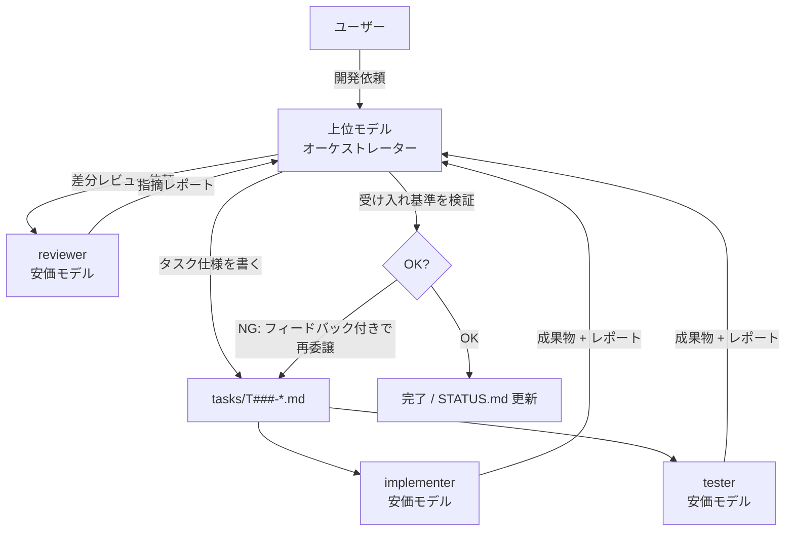

# copilot-cli-template

GitHub Copilot CLI で **上位モデルを「戦略役(オーケストレーター)」**、**安価なモデルのカスタムエージェントを「実働役(ワーカー)」** として使い分けるための開発テンプレートです。

高価な上位モデル(Claude Sonnet / GPT-5 など)は計画・指示・検証・意思決定だけに使い、コードを書く・テストする・レビューするといったトークンを大量に消費する作業は安価なモデル(GPT-5 mini など、プレミアムリクエスト倍率 0x〜低倍率)のエージェントに任せることで、**プレミアムリクエストを節約しながら品質を保つ**ことを狙います。

Copilot が標準で認識する仕組み(`AGENTS.md`、`.github/agents/*.agent.md`)だけで構成しているため、**Copilot CLI でも VS Code + GitHub Copilot でも同じ設定がそのまま使えます**。VS Code 専用機能は使っていません。

## コンセプト



| 役割 | モデル | やること | やらないこと |
|---|---|---|---|
| オーケストレーター | 上位モデル(セッションで選択) | 要件整理、タスク分解、仕様書作成、結果検証、やり直し判断、進捗管理 | 実装・テスト・詳細レビューを自分でやらない |
| implementer | 安価モデル(`.github/agents/` で固定) | タスク仕様に沿った実装 | 仕様外の変更、勝手な設計判断 |
| tester | 安価モデル | テスト作成・実行・失敗解析 | プロダクションコードの書き換え |
| reviewer | 安価モデル(read/search/shell のみ) | 差分レビュー、指摘レポート | コードの修正 |

## クイックスタート

1. **このテンプレートからリポジトリを作る**

   ```sh
   gh repo create my-project --template giwarb/copilot-cli-template --private --clone
   cd my-project
   ```

2. **Copilot CLI を上位モデルで起動する**

   ```sh
   copilot --model claude-sonnet-4.5
   ```

   (起動後に `/model` で切り替えても OK。利用可能なモデル名は `/model` の一覧で確認できます)

3. **開発したいものを普通に依頼する**

   `AGENTS.md` に運用ルールが書いてあるため、オーケストレーターは自動的に「タスク分解 → tasks/ に仕様書作成 → カスタムエージェントへ委譲 → 検証 → 進捗更新」のループで動きます。

### VS Code + GitHub Copilot で使う場合

同じリポジトリをそのまま VS Code で開けば、`AGENTS.md` と `.github/agents/` のカスタムエージェントが Copilot Chat からも利用できます(エージェントピッカーに implementer / tester / reviewer が表示されます)。運用は Copilot CLI の場合と同じです。

## 進捗の見える化

- **`tasks/STATUS.md`** — 全タスクの一覧ボード。オーケストレーターが状態遷移のたびに更新します。これを開いておけば今どこまで進んでいるかが一目で分かります。
- **`tasks/T###-*.md`** — タスクごとの仕様書 + 作業ログ。担当エージェントが末尾の「作業ログ」に追記していくので、経緯を後から追えます。
- **`logs/`** — 別プロセス委譲した場合の実行ログ(git 管理外)。

## 別プロセスでワーカーを走らせる

セッション内での委譲のほかに、非対話モードの `copilot` を別プロセスで起動してタスクを丸ごと任せられます。独立性の高いタスクのバッチ実行や、オーケストレーターのコンテキストを消費したくない大きめの作業に向きます。

```powershell
# Windows
./scripts/copilot-task.ps1 tasks/T001-add-login.md
./scripts/copilot-task.ps1 tasks/T002-add-tests.md -Agent tester
```

```sh
# macOS / Linux
./scripts/copilot-task.sh tasks/T001-add-login.md
./scripts/copilot-task.sh tasks/T002-add-tests.md tester
```

`copilot --agent <name> -p "..." --allow-all` で非対話実行し、ログを `logs/` に保存します。

> **注意**: `--allow-all` は確認なしでツール実行を許可します。信頼できるリポジトリでのみ使用してください。古いバージョンの Copilot CLI ではフラグ名が `--allow-all-tools` です。

## リポジトリ構成

```
.
├── AGENTS.md              # オーケストレーターの運用ルール(Copilot CLI / VS Code が自動で読む)
├── README.md
├── .github/
│   └── agents/
│       ├── implementer.agent.md  # 実装担当(安価モデル)
│       ├── tester.agent.md       # テスト担当(安価モデル)
│       └── reviewer.agent.md     # レビュー担当(安価モデル・read/search/shell のみ)
├── tasks/
│   ├── STATUS.md          # 進捗ボード
│   └── _template.md       # タスク仕様のテンプレート
├── scripts/
│   ├── copilot-task.ps1   # 非対話モードでワーカーに委譲(Windows)
│   └── copilot-task.sh    # 非対話モードでワーカーに委譲(macOS/Linux)
└── logs/                  # ワーカーの実行ログ(git 管理外)
```

## カスタマイズ

- **ワーカーのモデル変更** — `.github/agents/*.agent.md` の frontmatter `model:` を編集します。既定は `gpt-5.3-codex`。利用可能なモデル ID は Copilot CLI の `/model` 一覧で確認してください。指定したモデルがプランで使えない場合は `model:` 行を削除すればセッションのモデルが使われます。
- **Auto モデル選択(10% 割引)を使う** — frontmatter の `model:` に `auto` を指定する方法は現時点で文書化されていません。Auto を使いたい場合は各エージェントの `model:` 行を削除し、セッションのモデルを `/model` で Auto にしてください(`model:` 未指定のエージェントはセッションのモデルを継承します)。この場合オーケストレーターも Auto になる点に注意。
- **エージェントの追加** — `.github/agents/<名前>.agent.md` を追加するだけです。調査・要約専用のエージェントを追加するのも効果的です。
- **ユーザー単位のエージェント** — リポジトリ横断で使いたい場合は `~/.copilot/agents/` に置けます(同名ならホーム側が優先)。
- 言語・フレームワーク固有のビルド/テストコマンドが決まったら、`AGENTS.md` の「プロジェクト固有情報」セクションに追記してください。

## ライセンス

MIT
