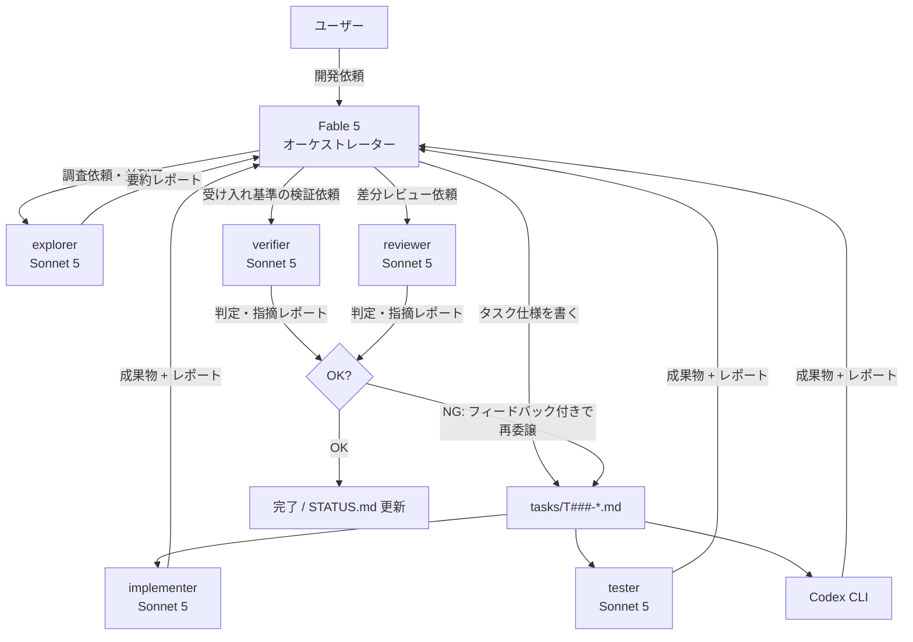

# coding-agent-template

Claude Code の **Fable 5 を「戦略役(オーケストレーター)」**、**Sonnet 5 サブエージェント / Codex CLI を「実働役(ワーカー)」** として使い分けるための開発テンプレートです。

高価な上位モデル(Fable 5)は計画・指示・検証・意思決定だけに使い、コードを調べる・書く・テストする・検証する・レビューするといったトークンを大量に消費する作業は安価なエージェントに任せることで、**課金を節約しながら品質を保つ**ことを狙います。

## コンセプト



| 役割 | モデル | やること | やらないこと |
|---|---|---|---|
| オーケストレーター | Fable 5(このセッション) | 要件整理、タスク分解、仕様書作成、やり直し判断、進捗管理 | 調査・実装・テスト・検証・詳細レビューを自分でやらない。`tasks/` と `CLAUDE.md` 以外を直接編集しない |
| explorer | Sonnet 5(サブエージェント・読み取り専用) | コードベースの調査・影響範囲の特定(**並列委譲可**) | ファイルの修正 |
| implementer | Sonnet 5(サブエージェント) | タスク仕様に沿った実装 | 仕様外の変更、勝手な設計判断 |
| tester | Sonnet 5(サブエージェント) | テスト作成・実行・失敗解析 | プロダクションコードの書き換え |
| verifier | Sonnet 5(サブエージェント) | 受け入れ基準のコマンド実行・合否判定 | コード・テストの修正(書き込みは作業ログ追記のみ) |
| reviewer | Sonnet 5(サブエージェント・読み取り専用) | 差分レビュー、指摘レポート | コードの修正 |
| Codex CLI | gpt-5-codex 等 | 独立性の高い実装タスク | — |

## クイックスタート

1. **このテンプレートからリポジトリを作る**

   ```sh
   gh repo create my-project --template giwarb/coding-agent-template --private --clone
   cd my-project
   ```

2. **Claude Code を上位モデルで起動する**

   ```sh
   claude --model claude-fable-5
   ```

   (起動後に `/model` で切り替えても OK。Fable 5 が使えないプランなら Opus でも同じ運用ができます)

3. **開発したいものを普通に依頼する**

   `CLAUDE.md` に運用ルールが書いてあるため、オーケストレーターは自動的に「調査委譲 → タスク分解 → tasks/ に仕様書作成 → サブエージェントへ委譲 → 検証 → 進捗更新」のループで動きます。

## 進捗の見える化

- **`tasks/STATUS.md`** — 全タスクの一覧ボード。オーケストレーターが状態遷移のたびに更新します。これを開いておけば今どこまで進んでいるかが一目で分かります。
- **`tasks/T###-*.md`** — タスクごとの仕様書 + 作業ログ。担当エージェントが末尾の「作業ログ」に追記していくので、経緯を後から追えます。
- **`logs/`** — Codex CLI に委譲した場合の実行ログ(git 管理外)。
- Claude Code の UI 上でもサブエージェントの実行はリアルタイムに表示されます。

## Codex をワーカーに使う

Codex CLI がインストール済みなら、タスク仕様ファイルをそのまま渡せます:

```powershell
# Windows
./scripts/codex-task.ps1 tasks/T001-add-login.md
```

```sh
# macOS / Linux
./scripts/codex-task.sh tasks/T001-add-login.md
```

`codex exec --full-auto` で非対話実行し、ログを `logs/` に保存します。どちらを使うか(Sonnet サブエージェント / Codex)の判断基準は `CLAUDE.md` を参照してください。

毎回の許可プロンプトを省きたい場合は、`.claude/settings.json.example` の内容を確認して `.claude/settings.json` にリネームしてください。

## オーケストレーターが逸脱するとき

`CLAUDE.md` は LLM への指示であり強制力はないため、メインセッション(上位モデル)がタスクを作らず直接コードを書き始めることがあります。その場合の対処:

- **権限プロンプトで止める** — Claude Code は既定でファイル編集前に承認を求めます。メインセッションが `tasks/` と `CLAUDE.md` 以外への書き込み承認を求めてきたら **拒否** し、「CLAUDE.md の絶対ルールに従って、タスクを作ってワーカーに委譲して」と返します。auto-accept モード(Shift+Tab)や `--dangerously-skip-permissions` は、この防波堤がなくなるため非推奨です。
- **早めに指摘する** — 一度直接編集を許すと、以降のターンでも「前例」として直接編集を続けがちです。最初の逸脱で指摘するのが最も効きます。
- **長いセッションを引きずらない** — コンテキストが長くなるほど `CLAUDE.md` の遵守率は下がります。話題や作業単位の区切りで `/clear` するか新しいセッションを開始してください。

## リポジトリ構成

```
.
├── CLAUDE.md              # オーケストレーター(Fable 5)の運用ルール
├── README.md
├── .claude/
│   ├── settings.json.example  # codex 実行などの権限プリセット(リネームして有効化)
│   └── agents/
│       ├── explorer.md    # 調査担当(Sonnet 5・読み取り専用・並列委譲可)
│       ├── implementer.md # 実装担当(Sonnet 5)
│       ├── tester.md      # テスト担当(Sonnet 5)
│       ├── verifier.md    # 受け入れ検証担当(Sonnet 5・コード修正禁止)
│       └── reviewer.md    # レビュー担当(Sonnet 5・読み取り専用)
├── tasks/
│   ├── STATUS.md          # 進捗ボード
│   └── _template.md       # タスク仕様のテンプレート
├── scripts/
│   ├── codex-task.ps1     # Codex へタスクを委譲(Windows)
│   └── codex-task.sh      # Codex へタスクを委譲(macOS/Linux)
└── logs/                  # ワーカーの実行ログ(git 管理外)
```

## カスタマイズ

- サブエージェントのモデルは `.claude/agents/*.md` の frontmatter `model:` で変更できます(`sonnet` / `haiku` / `opus` / `inherit`)。節約をさらに進めたい場合は、explorer を `haiku` にするのが効果的です。
- エージェントの追加は `.claude/agents/<名前>.md` を置くだけです。ドキュメント作成専用などプロジェクトに合わせた役割を足せます。
- 言語・フレームワーク固有のビルド/テストコマンドが決まったら、`CLAUDE.md` の「プロジェクト固有情報」セクションに追記してください。

## ライセンス

MIT
